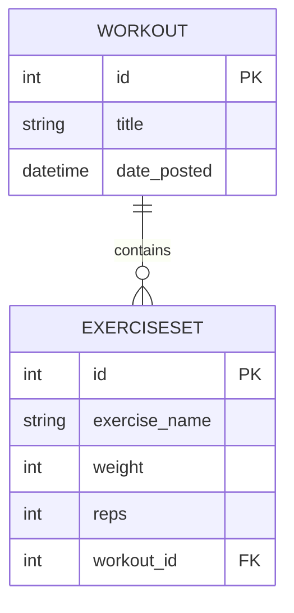

# 🏋️ Workout Tracker

A professional Flask-based web application designed to log and track daily training sessions. Built as part of the "30 Days of Python" challenge, this project focuses on relational database integrity, clean environment architecture, and Pythonic data processing.

## 📁 Project Structure

The application follows standard Flask conventions to ensure portability and ease of maintenance:

```text
.
├── app.py              # Main application logic, Database models, and Routes
├── requirements.txt    # Project dependencies (Flask, SQLAlchemy, etc.)
├── .gitignore          # Shields environment and database binaries from VCS
├── instance/           # Local SQLite storage (auto-generated on first run)
└── templates/          # Jinja2 HTML templates
    ├── index.html      # History view and deletion interface
    └── add.html        # Multi-input workout entry form
```

## 🚀 Features

* **Relational Logging:** Track workouts with a parent-child relationship (1 Workout -> Many Exercise Sets).
* **History Management:** View a reverse-chronological log of all training sessions.
* **Atomic Deletions:** Integrated SQLAlchemy cascades ensure that deleting a workout automatically cleans up all associated exercise data.
* **Portable Architecture:** Fully configured for immediate deployment with virtual environments and dependency tracking.

## 🛠️ Technical Challenges & Solutions

During development, I encountered and solved several technical hurdles:
1. **Database Architecture & Referential Integrity**

   The core the app relies on a **One-to-Many** relationship between the ``Workout`` (parent) and the ``ExerciseSet`` (child).
   * **The Challenge:** Managing the lifecycle of data. Simply deleting a ``Workout`` would typically leave "orphan" ``ExerciseSets`` in the database, leading to data corruption and storage bloat.
   * **The Solution:** I implemented ``cascade="all, delete-orphan"`` within the ``db.relationship``. This ensures that when a user deletes a workout, all associated sets are handled correctly and automatically by the database engine.
2. **Handling Parallel Form Data with ``zip()``**

   The "Add Workout" form submits multiple lists of data simultaneously (Exercise Names, Weights, Reps).
   * **The Challenge:** Flask's ``request.form.getlist`` returns separate, disconnected lists. Mapping the specific exercise name to the specific weight and specific rep count across three lists is traditionally error-prone.
   * **The Solution:** Utilized Python’s ``zip()`` function in the backend. This allowed me to iterate over the lists in parallel to reconstruct structured ``ExerciseSet`` objects before committing them to the database, ensuring data alignment.
3. **Environment & Git Recovery**
   * **The Challenge:** Moving the project from a generic learning directory (``30DaysOfPython``) to a dedicated development folder caused "ghost" ``.git`` directories and broken virtual environment paths.
   * **The Solution:** I performed a full repository reset, correctly configured a ``.gitignore`` shield to exclude the ``instance/`` folder and ``venv/``, and generated a ``requirements.txt`` to ensure the project is professional and "clone-and-run" ready.
4. **Automated Schema Initialization**
   * **The Challenge:** Preventing "Database Not Found" errors for new users.
   * **The Solution:** Wrapped ``db.create_all()`` within an ``app.app_context()`` block in the entry point. This automatically detects and generates the SQLite database file and tables upon the first launch, removing manual setup steps.

## 📊 Data Schema

The database relationship allows for seamless querying of a workout´s sets via ``workout.sets``.



## 🛤️ Future Roadmap

* **N+1 Optimization:** Implementing ``joinedload`` to improve database performance by reducing the number of queries needed to display the history log.
* **Dynamic UI:** Adding JavaScript to allow users to add/remove set rows dynamically, replacing the current static input limit.
* **Data Validation:** Integrating ``Flask-WTF`` for robust server-side sanitization and CSRF protection.

## 🔧 Setup Instructions

1. **Clone the repository.**
2. **Create a virtual environment:** ``python -m venv venv``
3. **Activate the environment:**
   * Windows: ``venv\Scripts\activate``
   * macOS/Linux: ``source venv/bin/activate``
4. **Install dependencies:** ``pip install -r requirements.txt``
5. **Run the app:** ``python app.py``