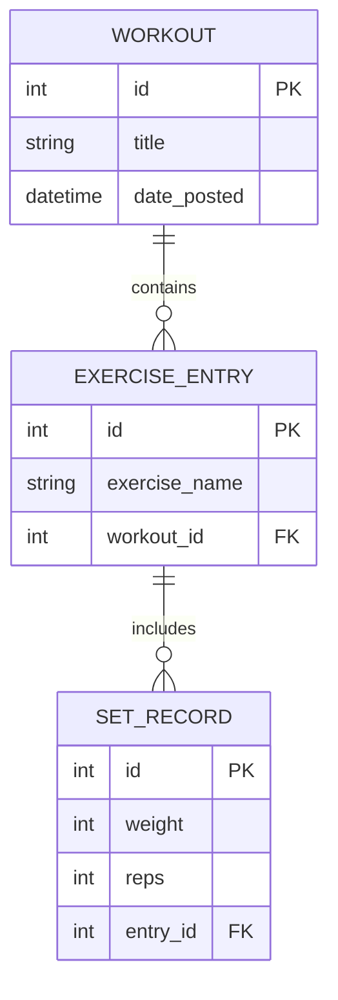

# 🏋️ Workout Tracker

A robust Flask-based web application designed to log and track complex training sessions. This project has evolved from a basic "30 Days of Python" challenge into a robust application featuring a normalized 3-tier database architecture and a modern dashboard UI.

## 📁 Project Structure

The application follows standard Flask conventions noe featuring a dedicated sidebar layout for a dashboard experience:

```text
.
├── app.py              # Main application logic, 3-tier Models, and Routes
├── requirements.txt    # Project dependencies (Flask, SQLAlchemy, etc.)
├── .gitignore          # Shields environment and database binaries from VCS
├── instance/           # Local SQLite storage (v1.2 Schema)
├── static/
│   └── style.css       # External CSS (Dark Mode, Sidebar, & Component styles)
└── templates/          # Jinja2 HTML templates
    ├── index.html      # Dashboard history view 
    └── add.html        # Multi-tiered workout entry form
```

## 🚀 Version 1.2.0 Features

* **3-Tier Relational Mapping:** Data is now logically separated into Workouts (Session), Exercise Entries (Movement), and Set Records (Performance).
* **Sidebar Dashboard UI:** Transitioned from a legacy top-navigation bar to a modern, Gemini-inspired sidebar for better accessibility and a "web-app" feel.
* **Smart History Nesting:** The history log now dynamically nests sets within exercise cards, which are nested within workout sessions.
* **Atomic Deletions:** Refined SQLAlchemy cascades ensure that deleting a workout cleans up all child entries and grandchild sets automatically.

## 🛠️ Technical Challenges & Solutions

During development, I encountered and solved several technical hurdles:
1. **Database Normalization (The Move to 3-Tier)**

   * **The Challenge:** In v1.1.0, exercise names were repeated for every set, leading to data redundancy and making it difficult to analyze performance per movement.
   * **The Solution:** I refactored the database schema. I introduced an intermediate ``ExerciseEntry`` table.

      * ``Workout`` (1) ➔ ``ExerciseEntry`` (Many)
      * ``ExerciseEntry`` (1) ➔ ``SetRecord`` (Many)
        
        This allows for much cleaner data queries and future "Personal Best" tracking features.

2. **Multi-Level Data Reconstruction**

   * **The Challenge:** The "Add Workout" form now submits deeply nested data (Exercise Name ➔ Multiple Weights ➔ Multiple Reps).

   * **The Solution:** I implemented an indexed naming convention in HTML (``weight_{{ i }}``) and used Python's backend logic to "flush" parent IDs before committing children. This ensures that every set is tied to the correct exercise, and every exercise to the correct workout, without integrity errors.

3. **Dashboard Layout Refactor**

   * **The Challenge:** As the app grew, a top-navigation bar felt crowded and "legacy" (the "1995" look).

   * **The Solution:** Implemented a CSS Flexbox-based Sidebar. By setting a fixed-width ``nav`` and a flexible ``main`` content area, the app now feels like a modern productivity dashboard.

4. **Automated Schema Initialization**
   * **The Challenge:** Preventing "Database Not Found" errors for new users.
   
   * **The Solution:** Wrapped ``db.create_all()`` within an ``app.app_context()`` block in the entry point. This automatically detects and generates the SQLite database file and tables upon the first launch, removing manual setup steps.

## 📊 Data Schema (v1.2.0)

The new schema ensures that one movement (e.g., Bench Press) can contain multiple performance records (sets) within a single session.



## 🛤️ Future Roadmap

* **N+1 Optimization:** Implementing ``joinedload`` to improve database performance by reducing the number of queries needed to display the history log.
* **Dynamic Set Injection:** Using Vanilla JS to allow users to add/remove sets and exercises on the fly without page refreshes.
* **Data Validation:** Integrating ``Flask-WTF`` for robust server-side sanitization and CSRF protection.

## 🔧 Setup Instructions

1. **Clone the repository.**
2. **Create a virtual environment:** ``python -m venv venv``
3. **Activate the environment:**
   * Windows: ``venv\Scripts\activate``
   * macOS/Linux: ``source venv/bin/activate``
4. **Install dependencies:** ``pip install -r requirements.txt``
5. **Initialize Database:** (Crucial: Delete any ``workout.db`` from v1.1.0 to allow the new schema to generate).
5. **Run the app:** ``python app.py``