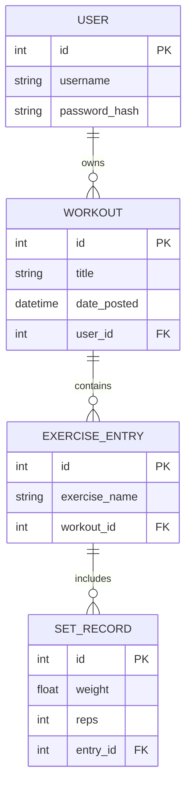

# 🏋️ Workout Tracker (v.1.3.0)

A secured, full-stack Flask application designed for high-precision training logs. Evolving from a "30 Days of Python" challenge, this project now features a 4-tier relational database, secure user authentication, and a modern dashboard UI.

## 📁 Project Structure

The application follows standard Flask conventions, now featuring environment security and a dashboard-centric layout:

```text
.
├── app.py              # Main application logic, 4-tier Models, and Routes
├── .env                # (Local only) Secured Environment Variables (Secret Keys)
├── .gitignore          # Shields .env, venv, and database binaries from VCS
├── requirements.txt    # Project dependencies (Flask, SQLAlchemy, Dotenv, etc.)
├── instance/           # Local SQLite storage
├── static/
│   └── style.css       # External CSS (Dark Mode, Sidebar, & Card-based UI)
└── templates/          # Jinja2 HTML templates
    ├── index.html      # Dashboard history view & Login gateway
    ├── add.html        # Multi-tiered workout entry form
    └── register.html   # User registration
```

## 🚀 Version 1.3.0 New Features

* **Secure User Authentication:** Implemented ``Flask-Login`` for session management and password hashing, allowing multiple users to track their progress privately.
* **Environment Security:** Transitioned to ``python-dotenv`` architecture. Sensitive data like ``SECRET_KEY`` and ``DATABASE_URL`` are now managed via environment variables, keeping credentials off GitHub.
* **4-Tier Relational Mapping:** Added a ``User`` model to the hierarchy. Data is now logically mapped: ``User`` ➔ ``Workout`` ➔ ``Exercise`` ➔ ``Set``.
* **CSRF Protection:** Integrated ``Flask-WTF`` to protect all form submissions (Add Workout, Delete, Login) against Cross-Site Request Forgery.
* **Refined Card UI:** New "Exercise Group Cards" provide a clear visual distinction between movements and sets, optimized for both desktop and mobile viewing.

## 🛠️ Technical Challenges & Solutions

During development, I encountered and solved several technical hurdles:
1. **The Security "Shift-Left"**

   * **The Challenge:** Storing a hardcoded ``SECRET_KEY`` in ``app.py`` is a security risk when pushing to public repositories.
   * **The Solution:** Implemented ``.env`` file support. I refactored the app to load configurations using ``os.environ.get()``, with a safe fallback for local development, ensuring no secrets are leaked to the Git history.

2. **Relational User-Data Mapping**

   * **The Challenge:** Ensuring users can only see and delete their own workout history.

   * **The Solution:** Established a One-to-Many relationship between ``User`` and ``Workout``. Refactored backend routes to query ``current_user.workouts``, creating a secure data sandbox for every account.

3. **Floating-Point Precision**

   * **The Challenge:** Legacy ``int`` fields prevented users from logging precise weights (e.g., 22.5kg).

   * **The Solution:** Migrated the ``weight`` column in the ``SetRecord`` table to ``Float`` and updated HTML inputs with ``step="0.1"``, allowing for professional-grade tracking.

4. **Advanced CSS Component Logic**
   * **The Challenge:** Distinguishing between "Viewing" mode and "Input" mode in a dark-themed UI.
   
   * **The Solution:** Created modular CSS "Chapters." I separated ``exercise-display-group`` (compact history view) from ``exercise-input-card`` (interactive form view), enhancing the overall UX.

## 📊 Data Schema (v1.3.0)



## 🛤️ Future Roadmap

* **N+1 Optimization:** Implementing ``joinedload`` to improve database performance by reducing the number of queries needed to display the history log.
* **Dynamic Set Injection:** Using Vanilla JS to allow users to add/remove sets and exercises on the fly without page refreshes.

## 🔧 Setup Instructions

1. **Clone the repository.**
2. **Create a virtual environment:** ``python -m venv venv``
3. **Activate the environment:**
   * Windows: ``venv\Scripts\activate``
   * macOS/Linux: ``source venv/bin/activate``
4. **Install dependencies:** ``pip install -r requirements.txt``
5. **Configure Environment:**
    * Create a ``.env`` file in the root directory.
    * Add: ``SECRET_KEY=your_random_string``
6. **Initialize Database:** (Crucial: Delete any ``workout.db`` from v1.2.0 to allow the new schema to generate).
7. **Run the app:** ``python app.py``